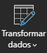
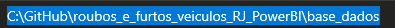

# 
📊 Análise de Roubos e Furtos no Rio de Janeiro

  

---

## 
📌 Sobre

Dashboard georreferenciado desenvolvido no **Power BI** para análise criminal, utilizando dados abertos do RJ.  
*Projeto acadêmico em parceria com [RioOn](https://rioon.rio.br/) e [Senac RJ](https://www.rj.senac.br/).*

---

## 
🛠️ Tech Stack

  
  
  

---

## 
📊 Análises

✔ **Top 10** Crimes e Municípios  
✔ Evolução temporal (ano/mês)  
✔ Comparação regional  
✔ Roubo vs Recuperação de veículos  

---

## 
📁 Bases Utilizadas

- [Dados ISP RJ](https://www.ispdados.rj.gov.br/)
- [Localização de Delegacias](https://github.com/vivianebatista92/roubos_e_furtos_veiculos_RJ_PowerBI)

---

 ## ❓ Utilização do Projeto

- O arquivo do Power BI, por possuir uma tabela que não é hospedada em algum site, para funcionar, deve seguir alguns passos:

|   Ação   | Imagem                                                                                                                                                                                                                                                                         |
| :------: | ------------------------------------------------------------------------------------------------------------------------------------------------------------------------------------------------------------------------------------------------------------------------------ |
|  Ao baixar a pasta do projeto, abra o Power BI    | 
|  Clicar em Transformar Dados:  |  |
| Clicar em Local Base | |
| Verificar o caminho no seu computador de onde está a tabela DP e copiar |  |
| Colar esse caminho no campo valor do Local Base |  |

# 

